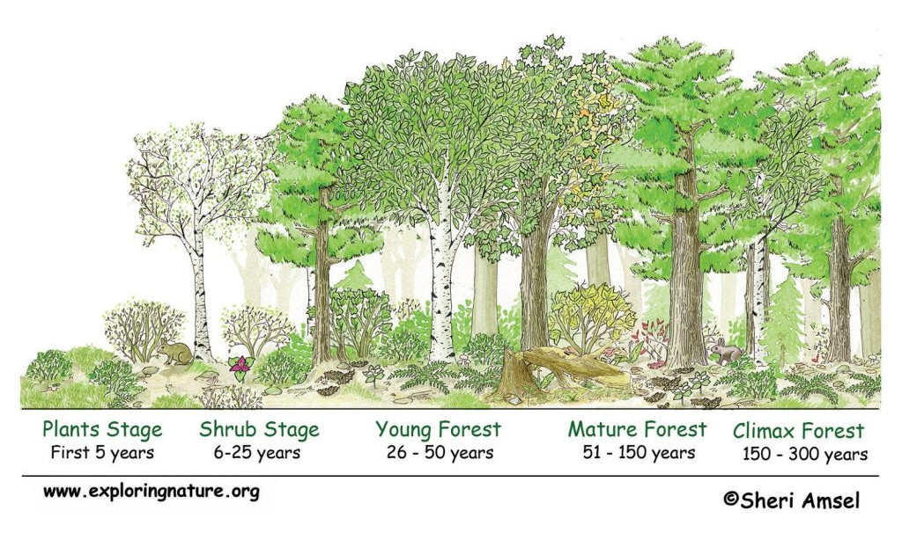

## Le a pázsittal!

## A növényzet kialakulása. A szukcesszió

Ahol nem volt növényzet: primer szukcesszió

Ahol volt, de eltűnt: szekunder szukcesszió - talajban nyugvó magvak, vegetatív szaporítóképletek

A szukcessziós folyamatok korai stádiumának fajai, a pionír fajok általában gyors növekedésűek, kis termetűek, rövid életűek, nagy területre képesek szaporítóképleteiket eljuttatni (r-stratégisták).

Ökológiai megközelítés: a gyomok a talaj „bolygatásához”, műveléséhez legjobban alkalmazkodó növények. A növénytermesztés során a vegetációs idő alatt többször is bolygatják a talajt, így azok a növényfajok, melyek a háborítatlan talajt igénylik, nem tudnak megélni, viszont olyan növények szaporodnak el, amelyek rövidebb tenyészidejűek, gyors fejlődésűek, vagy olyan évelő fajok, melyek mélyen ülő gyökerei a talajművelés során okozott feldarabolódást nem sínylik meg, sőt az vegetatív szaporodásukat segíti. Ilyen módon a gyomnövények a másodlagos szukcesszió pionír fajainak tekinthetők.

## Pannonian Climate. A Kárpát-medence klímája

[https://www.eea.europa.eu/publications/report_2002_0524_154909/biogeographical-regions-in-europe/pannonian.pdf](https://www.eea.europa.eu/publications/report_2002_0524_154909/biogeographical-regions-in-europe/pannonian.pdf)

Pannonia has a continental climate, with hot summers with low overall humidity levels but frequent rainshowers and mildly cold snowy winters. Average annual temperature is 8.9 °C. Average high temperature in the summer is 22 to 26 °C and average low temperature in the winter is −5 to −9 °C. The average yearly rainfall is approximately 700 mm.

According to the Köppen classification, most of Pannonia used to have a temperate continental climate (Dfb). The highland has a cool continental climate (Dfc). The south has a warm continental climate (Dfa). Due to climate change, the Pannonian Basin is transitioning to Cfa/Dfa humid subtropical climate.

[https://www.geopoeia.net/wiki/Climate_of_Pannonia](https://www.geopoeia.net/wiki/Climate_of_Pannonia)

## Klímaváltozás. Elsivatagosodás

Hardiness zones indicate how cold the winters are. Traditionally Hungary and the Pannonian Basin used to be on the border of zones 6-7, but in the recent years our climate is changed so much that we don't see winters colder than zone 8.

## Őshonos növények Magyarországon

Az egyes erdészeti tájakon őshonos fajok jegyzéke, 2. számú melléklet a 153/2009. (XI. 13.) FVM rendelethez [https://njt.hu/jogszabaly/2009-153-20-82](https://njt.hu/jogszabaly/2009-153-20-82)

Bennszülött növények a Pannóniai flóratartományban [https://www.dunaipoly.hu/uploads/2023-05/20230526164539-bennszulott-novenyek-2023-magyar-media-kxuo4yen.pdf?1.22.6](https://www.dunaipoly.hu/uploads/2023-05/20230526164539-bennszulott-novenyek-2023-magyar-media-kxuo4yen.pdf?1.22.6)

List of all life in the Pannonicum [https://www.inaturalist.org/places/hungary](https://www.inaturalist.org/places/hungary)

The part of the Pannonian Steppe in Hungary has a grassland biome with steppes, forest steppes, dedicuous forests and some wetlands.

Lombhullató erdők és erdős sztyepp határvidéke, füves puszta, sztyepp és vizes területek, láprétek, mocsárrétek alkotják.

## A talaj takarásának fontossága. Az avar

### A mulcsozás. A mélymulcs

Így építs termőréteget https://greendex.hu/melymulcs-hogyan-csinaljuk-miert-jo/

[https://gazigazito.hu/a-mulcs-csodai-483780](https://gazigazito.hu/a-mulcs-csodai-483780)

Mit kezdjunk a levagott fűvel?[https://gazigazito.hu/mit-kezdjunk-a-levagott-fuvel-1053981](https://gazigazito.hu/mit-kezdjunk-a-levagott-fuvel-1053981)

### Talajtakarók. 

Hogyan alakíts ki alacsony növésű, minimális törődést igénylő gyepet talajtakaró növényekkel

Gyephelyettesítő talajtakarók

* fehér here
* kúszó pázsitszulák, dichondra repens
* moha

Virágzó talajtakarók [https://www.botanikaland.hu/talajtakaro-novenyek/](https://www.botanikaland.hu/talajtakaro-novenyek/)

* pénzlevelű lizinka (Lysimachia)
* apró szulák (Convolvulus)
* kakukkfű, creeping thyme
* kis/nagy meténg, vinca minor/major
* veronika
* illatos gólyaorr (Geranium)
* pázsitviola (Aubtieta)
* Creeping Phlox
* macskamenta (Nepeta)

### Nitrogén megkötésének képessége. Cover crops
https://en.wikipedia.org/wiki/Nitrogen_fixation#Root_nodule_symbioses

## A biodiverzitás fontossága

A biodiverzitás [https://sokszinuvidek.24.hu/kertunk-portank/2021/04/16/erdokert-biodiverzitas-tervezes/](https://sokszinuvidek.24.hu/kertunk-portank/2021/04/16/erdokert-biodiverzitas-tervezes/)

Companion planting https://en.wikipedia.org/wiki/Companion_planting

## Gyep és pázsit

A tarackkal terjedő fajták jól záródó pázsitot alkotnak, de igényesek. A csomósan terjedő fajták rosszul záródó pázsitot képeznek, de szárazságtűrőbbek, igénytelenebbek. A legtömöttebb gyepet a vörös csenkesz és a tarackos tippan adja, őket követi a sorban az angol perje és a réti perje.  

A pázsit rövidre nyírt, apró szálú és finom levelű füvekből álló, szőnyegszerű gyeptakaró. A pázsitot alkotó pázsitfüvek életképessége akkor a legmegfelelőbb, ha nem tapossák, ha nem nyírják túl mélyen. A pázsitok víz-, és tápanyag-, és nyírásigényesek.  

A fűnyírás. A fű nyírásának hatása a talaj hőmérsékletére

Ökológiai szemléletű gyeptelepítés elmélete és gyakorlata [https://orgprints.org/id/eprint/30119/1/Torok-Tothmeresz-Gyepkotet-2015.pdf](https://orgprints.org/id/eprint/30119/1/Torok-Tothmeresz-Gyepkotet-2015.pdf)

the no-mow lawn. grass alternatives. [https://lawnlove.com/blog/types-of-no-mow-grass-alternatives/](https://lawnlove.com/blog/types-of-no-mow-grass-alternatives/)

## A fűfélék, élőhelye és tulajdonságai

Kaszálók és magasfüvű rétek. [http://www.jgypk.hu/mentorhalo/tananyag/Biologia/73_a_fves_terletek_lvilga.html](http://www.jgypk.hu/mentorhalo/tananyag/Biologia/73_a_fves_terletek_lvilga.html)

Poaceae: a fűfélék vagy pázsitfüvek szerepe a természetben

[https://web.archive.org/web/20080221195432/http://www.hik.hu/tankonyvtar/site/books/b159/ch22s75.html](https://web.archive.org/web/20080221195432/http://www.hik.hu/tankonyvtar/site/books/b159/ch22s75.html)

### Fűfélék a kertben

* perje (Lolium)
* réti perje (Poa)
* csenkesz (Festuca)
* komócsin (Phleum)
* nádtippan (Calamagrostis)
* cérnatippan (Agrostis)

## A vadvirágos rét. A méhlegelő.

milyen egy méhbarát kert? [https://kert.tv/milyen-egy-mehbarat-kert/](https://kert.tv/milyen-egy-mehbarat-kert/)

## Az erdőkert.

[https://xforest.hu/erdokert/](https://xforest.hu/erdokert/)

[https://greendex.hu/csereld-a-gyepet-erdokertre/](https://greendex.hu/csereld-a-gyepet-erdokertre/)

növények az erdőkertben [https://www.csodakertesz.hu/blog/novenyek-szintjei-az-erdokertben](https://www.csodakertesz.hu/blog/novenyek-szintjei-az-erdokertben)

[https://mannaerdokert.hu](https://mannaerdokert.hu)

## A permakultúra. Az ökológiai gazdálkodás.

https://www.megyeriszabolcskerteszete.hu/blog/onfenntarto_kert_mely_egesz_evben_ellat_minket_elelemmel_1
https://www.megyeriszabolcskerteszete.hu/blog/onfenntarto_kert_mely_egesz_evben_ellat_minket_elelemmel_2

[A permakultura alapelvei](https://permakultura.hu/wp-content/uploads/2020/01/A_permakultura_alapelvei.pdf) PDF   

[Gyulai Iván: Mélymulcs - ember és környezetkímélő kertgazdálkodás](https://permakultura.hu/wp-content/uploads/2020/01/A_permakultura_alapelvei.pdf) PDF   

permakultúra és erdőkert

[https://edenteremto.blogspot.com/2013/06/permakultura-es-erdokert.html](https://edenteremto.blogspot.com/2013/06/permakultura-es-erdokert.html)

[https://greendex.hu/egy-eletre-szolo-kerti-kaland-a-permakultura/](https://greendex.hu/egy-eletre-szolo-kerti-kaland-a-permakultura/)

ökológiai gazdálkodás és permakultúra

[https://archive2020.szie.hu/file/tti/archivum/Dorner_Zita_ertekezes.pdf](https://archive2020.szie.hu/file/tti/archivum/Dorner_Zita_ertekezes.pdf) PDF

## Bio, Organic, Biodynamic, Demeter

Biodynamics is a holistic, ecological, and ethical approach to farming, gardening, food, and nutrition. [https://www.biodynamics.com/what-is-biodynamics](https://www.biodynamics.com/what-is-biodynamics)

Bio- és biodinamikus vetőmagok a [Biokiskert](https://biokiskert.hu/biotermek/biovetomag-2/)en

ReinSaat vetőmagok [https://www.reinsaat.at/EN/](https://www.reinsaat.at/EN/)

What is Demeter? [https://demeter.net](https://demeter.net)

## Ajánló

[https://www.inaturalist.org/places/hungary](https://www.inaturalist.org/places/hungary) 

[https://www.megyeriszabolcskerteszete.hu](https://www.megyeriszabolcskerteszete.hu)

[https://gyomok.blogspot.com](https://gyomok.blogspot.com)

[https://vadviragom.hu](https://vadviragom.hu)

[https://gazigazito.hu](https://gazigazito.hu) - hogy tudd, mi az amit kigyomlálsz

[https://flora-on.pt/#/8Poales](https://flora-on.pt/#/8Poales)

[https://www.floralimages.co.uk/b_poaceae.htm](https://www.floralimages.co.uk/b_poaceae.htm)

[https://www.hainaultforest.net/nature-detective-winter-twigs] (https://www.hainaultforest.net/nature-detective-winter-twigs)
